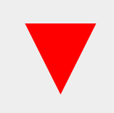

### 1. 三角形

<div align=center></div>

* 上三角

```css
.triangle-up {
    width: 0;
    height: 0;
    border-left: 50px solid transparent;
    border-right: 50px solid transparent;
    border-bottom: 100px solid red;
}
```

* 下三角

<div align=center></div>

```css
.triangle-down {
    width: 0;
    height: 0;
    border-left: 50px solid transparent;
    border-right: 50px solid transparent;
    border-top: 100px solid red;
}
```

* 左三角

<div align=center></div>

```css
.triangle-left {
    width: 0;
    height: 0;
    border-top: 50px solid transparent;
    border-right: 100px solid red;
    border-bottom: 50px solid transparent;
}
```

* 右三角

<div align=center></div>

```css
.triangle-right {
    width: 0;
    height: 0;
    border-top: 50px solid transparent;
    border-left: 100px solid red;
    border-bottom: 50px solid transparent;
}
```

### 2. 圆形

<div align=center></div>

```css
.circle {
    width: 100px;
    height: 100px;
    background: red;
    border-radius: 50%;
}
```

### 3.对话气泡

<div align=center></div>

```css
.talkbubble {
    width: 120px;
    height: 80px;
    background: red;
    position: relative;
    border-radius: 10px;
}
.talkbubble:before {
    content: "";
    position: absolute;
    right: 100%;
    top: 26px;
    width: 0;
    height: 0;
    border-top: 13px solid transparent;
    border-right: 26px solid red;
    border-bottom: 13px solid transparent;
}

```

### 4.指示器

<div align=center></div>

```css
.pointer {
    width: 200px;
    height: 40px;
    position: relative;
    background: red;
}

.pointer:after {
    content: "";
    position: absolute;
    left: 0;
    bottom: 0;
    width:  0; 
    height: 0;
    border-left: 20px solid white;
    border-top: 20px solid transparent;
    border-bottom: 20px solid transparent;
}

.pointer:before {
    content:"";
    position: absolute;
    right: -20px;
    bottom:0;
    width: 0;
    height: 0;
    border-left: 20px solid red;
    border-top: 20px solid transparent;
    border-bottom: 20px solid transparent;
}

```
